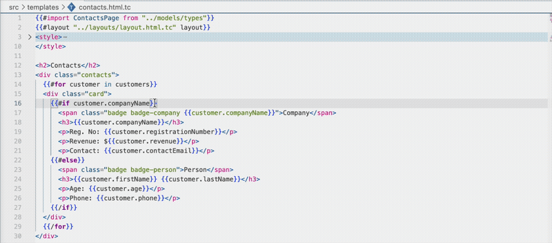
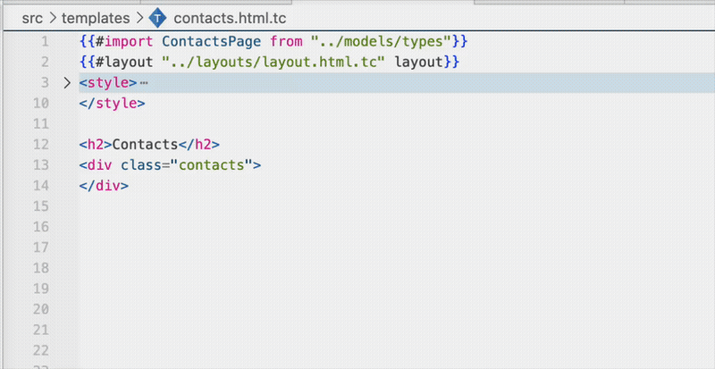
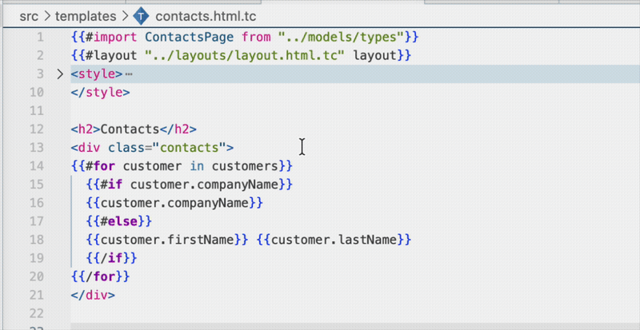
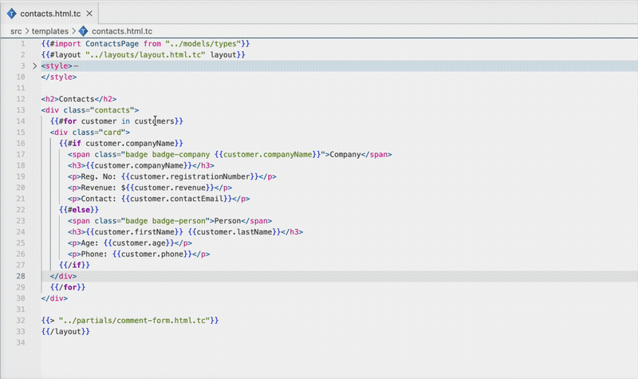

<h1>&nbsp;Typecek</h1>

[](https://github.com/rousek/typecek/actions/workflows/ci.yml) [](https://www.npmjs.com/package/@typecek/cli) [](https://github.com/rousek/typecek/blob/main/LICENSE) [](https://marketplace.visualstudio.com/items?itemName=typecek.typecek-vscode)

A typed templating language for TypeScript. Catch property typos, type mismatches, and missing fields at build time — not runtime.

---

## Features

### Type system
- **Type-checked templates** — every expression is validated against your TypeScript types at compile time
- **Union types** — properties are resolved across all union members, with type narrowing inside `{{#if}}` blocks
- **Optional chaining** — `{{user.address?.city}}` safely handles nullable properties
- **Compiles to TypeScript** — each `.tc` file becomes a typed `render(data: T): string` function

### Template language
- **Conditionals** — `{{#if}}` / `{{#else if}}` / `{{#else}}` with type narrowing
- **Loops** — `{{#for item in items}}` with `{{@index}}`, `{{@first}}`, `{{@last}}`, `{{@length}}`
- **Switch** — `{{#switch}}` / `{{#case}}` / `{{#default}}` for string matching
- **Scoping** — `{{#with}}` to scope into nested properties, `../` to access parent scopes
- **Layouts** — `{{#layout}}` / `{{@content}}` for reusable page wrappers
- **Partials** — `{{> "path" data}}` to render other templates inline
- **Expressions** — arithmetic (`+ - * /`), comparison (`== != < >`), logic (`&& || !`)
- **HTML auto-escaping** — `.html.tc` files escape output by default, `{{{raw}}}` for unescaped
- **Whitespace control** — `{{~ expr ~}}` strips surrounding whitespace

### VS Code extension
- Real-time type error diagnostics
- Type-aware autocomplete for properties, loop variables, tag snippets, and import paths
- Hover to see resolved types
- Go to Definition on properties and import paths
- Context-aware closing tag suggestions
- Syntax highlighting with expression support inside HTML attributes
- Embedded HTML and CSS language support

See the [template syntax reference](docs/tags.md) for detailed documentation on each tag.

## Getting Started

```bash
npm install @typecek/cli @typecek/runtime
npx typecek init
```

```bash
npx typecek compile    # Type-check and compile all .tc files
```

```typescript
import renderUser from "./user-card.html";

const html = renderUser({
  name: "Alice",
  email: "alice@example.com",
  isActive: true,
});
```

> The CLI is also available as `typecku`.

## VS Code Extension

Install the [**Typecek** extension](https://marketplace.visualstudio.com/items?itemName=typecek.typecek-vscode) for the full developer experience.

### Real-time type error diagnostics

Errors show up as you type — misspelled properties, type mismatches, missing fields.



### Type-aware autocomplete

Property completions, loop variables, tag snippets, import paths — all driven by your TypeScript types.



### Union type support

Typecek understands union types. Properties are resolved across all members, and type narrowing works inside `{{#if}}` blocks.



### Go to Definition

Ctrl+Click any property to jump straight to its TypeScript declaration.



## Project Structure

```
packages/
  core/       Lexer, parser, type checker, type resolver, hover/completions
  compiler/   Compiles .tc templates to TypeScript
  runtime/    Runtime helpers (HTML escaping)
  cli/        CLI tool (compile, watch, list)
  vscode/     VS Code extension with LSP server
```

## Development

```bash
pnpm install
pnpm build
pnpm test
```

## License

MIT
